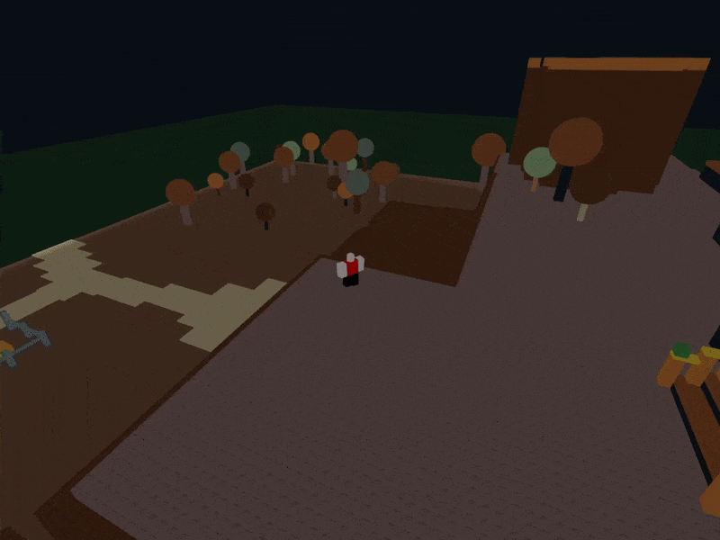

# nekoblocks

ROBLOX-like game engine made in Godot

Networking is partially implemented, can load most place files and move around in a playable state.

I intended for this to be an alternative to roblox, however i've largely left this for the time being, if anyone is interested in picking it up then by all means they can. 
